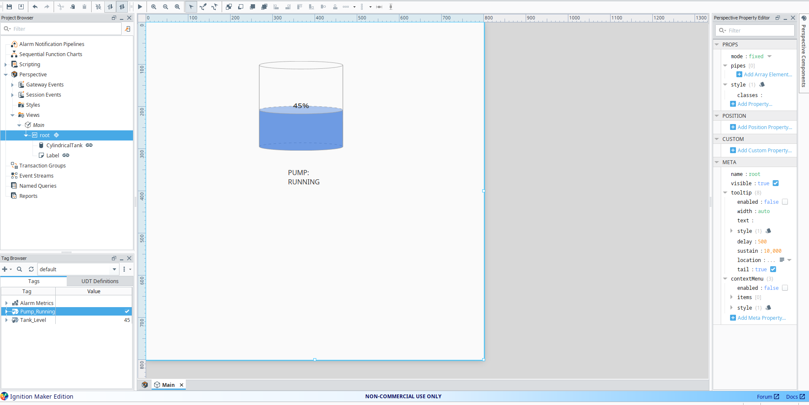

# water_tank_control_lab
Industrial automation portfolio project using Ignition SCADA, PLC control logic, alarms, historian, and process simulation.

## Current Progress

- Created simulated Tank_Level, Pump_Command, Pump_Running, Inlet_Valve_Command, Inlet_Valve_Running, High_Level, low_level,     and `Auto_Mode` tags in Ignition.
- Built a Perspective HMI with live tank visualization and operator controls.
- Added separate command and running/status logic for the pump and inlet valve.
- Added low-level pump protection to prevent draining below the minimum level.
- Added high-level inlet protection to prevent overfilling.
- Added a Gateway Timer Script to simulate tank filling and draining.
- Implemented high-level hysteresis with a 90% setpoint and 80% reset point.
- Added an AUTO/MANUAL mode selector to the HMI.
- Began implementing automatic tank-control logic.
  
## Current HMI

